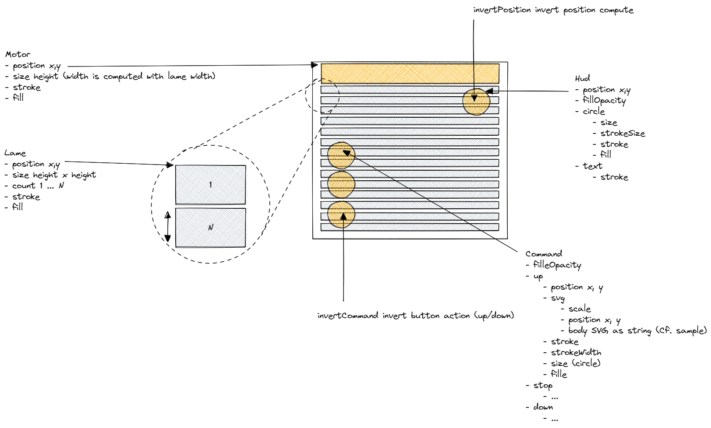

# Shutter Alt Card

A custom Lovelace card for Home Assistant to control a `cover` (shutter/blind)
entity, with an animated SVG rendering and drag-to-position control.



## Features

- SVG rendering of the shutter (slats, window, motor)
- Drag control to set a precise position
- Up / Stop / Down buttons
- Automatic detection of supported features on the entity
  (`open`, `close`, `set_position`, `stop`, `open_tilt`, `close_tilt`)
- Fully customizable configuration (colors, sizes, positions)

## Installation

### Via HACS (recommended)

1. Open HACS in Home Assistant
2. Go to **Frontend**
3. Search for **Shutter Alt Card**
4. Install, then add the resource if it isn't added automatically

### Manual installation

1. Download `hass-shutter-alt-card.js` from the latest [release](../../releases)
2. Copy it to `/config/www/`
3. Add the resource under **Settings > Dashboards > Resources**:
   ```yaml
   url: /local/hass-shutter-alt-card.js
   type: module
   ```

## Configuration

```yaml
type: custom:shutter-alt-card
entity: cover.my_shutter
title: Living Room
invertPosition: false
invertCommand: false
debug: false
```

| Option            | Type    | Default | Description                                        |
|--------------------|---------|---------|------------------------------------------------------|
| `entity`           | string  | required| The `cover.*` entity to control                     |
| `title`            | string  | -       | Title shown in the card header                      |
| `invertPosition`   | boolean | `false` | Inverts how the position is displayed                |
| `invertCommand`    | boolean | `false` | Inverts the up/down commands                         |
| `debug`            | boolean | `false` | Enables debug logging in the console                 |

Advanced options are available to customize the look and feel (slats, window,
motor, HUD, drag area, command buttons) — see [full configuration
docs](./docs/configuration.md) *(create this if you want to detail it)*.

## License

MIT — see [LICENSE](./LICENSE).

## Contributing

Issues and PRs are welcome.

## Annexe

Render model for up, down and stop

```yaml
command: 
  fillOpacity: 0.6
  up: 
    x: 40
    y: 96
    svg: 
      scale: 0.9
      x: -12
      y: 12
      body: "<path d=\"M12 11L12 19\" stroke=\"#200E32\" stroke-width=\"2\" stroke-linecap=\"round\" stroke-linejoin=\"round\"/>\n<path fill-rule=\"evenodd\" clip-rule=\"evenodd\" d=\"M16 11L12 5.00001L8.00001 11L16 11Z\" stroke=\"#200E32\" stroke-width=\"2\" stroke-linecap=\"round\" stroke-linejoin=\"round\"/>\n"
    stroke: "#000000"
    strokeWidth: "2"
    size: 20
    fill: "#ffffff"
  stop: 
    x: 40
    y: 140
    svg: 
      scale: 0.9
      x: -12
      y: 12
      body: "\n<path fill-rule=\"evenodd\" clip-rule=\"evenodd\" d=\"M9 8C8.44772 8 8 8.44772 8 9V15C8 15.5523 8.44772 16 9 16H15C15.5523 16 16 15.5523 16 15V9C16 8.44772 15.5523 8 15 8H9ZM6 9C6 7.34315 7.34315 6 9 6H15C16.6569 6 18 7.34315 18 9V15C18 16.6569 16.6569 18 15 18H9C7.34315 18 6 16.6569 6 15V9Z\" fill=\"#000000\"/>\n"
    stroke: "#000000"
    strokeWidth: "2"
    size: 20
    fill: "#ffffff"
  down: 
    x: 40
    y: 184
    svg: 
      scale: 0.9
      x: -12
      y: 12
      body: "\n<path d=\"M12 13L12 5\" stroke=\"#200E32\" stroke-width=\"2\" stroke-linecap=\"round\" stroke-linejoin=\"round\"/>\n<path fill-rule=\"evenodd\" clip-rule=\"evenodd\" d=\"M8 13L12 19L16 13L8 13Z\" stroke=\"#200E32\" stroke-width=\"2\" stroke-linecap=\"round\" stroke-linejoin=\"round\"/>\n"
    stroke: "#000000"
    strokeWidth: "2"
    size: 20
    fill: "#ffffff"
```

Backward area

```yaml
misc: 
  stroke: "#000000"
  fill: "#bfbfbf"
```

Lame render model

```yaml
lame: 
  x: 10
  y: 10
  width: 200
  height: 10
  count: 20
  stroke: "#000000"
  fill: "#ffffff"
```

Window render model

```yaml
window:
  frame:
    size: 10
    fill: "white"
  glass:
    fill: "grey"
```

Motot render model

```yaml
motor: 
  x: 0
  y: 0
  height: 30
  stroke: "#000000"
  fill: "#eebb00"
```

Hud render model

```yaml
hud: 
  x: 180
  y: 40
  fillOpacity: 0.6
  circle: 
    size: 20
    strokeSize: 2
    stroke: "#000000"
    fill: "#ffffff"
  text: 
    stroke: "#000000"
```

Drag and drop configuration

```yaml
drag:
  area: 
    x: 65
    y: 0
    width: 150
    height: 220
    fillOpacity: 0
  background: 
    stroke: "black"
    fill: "grey"
    fillOpacity: 0.2
  text: 
    stroke: "black"
    strokeWidth: 1
    fontSize: "2em"
    fill: "black"
```
