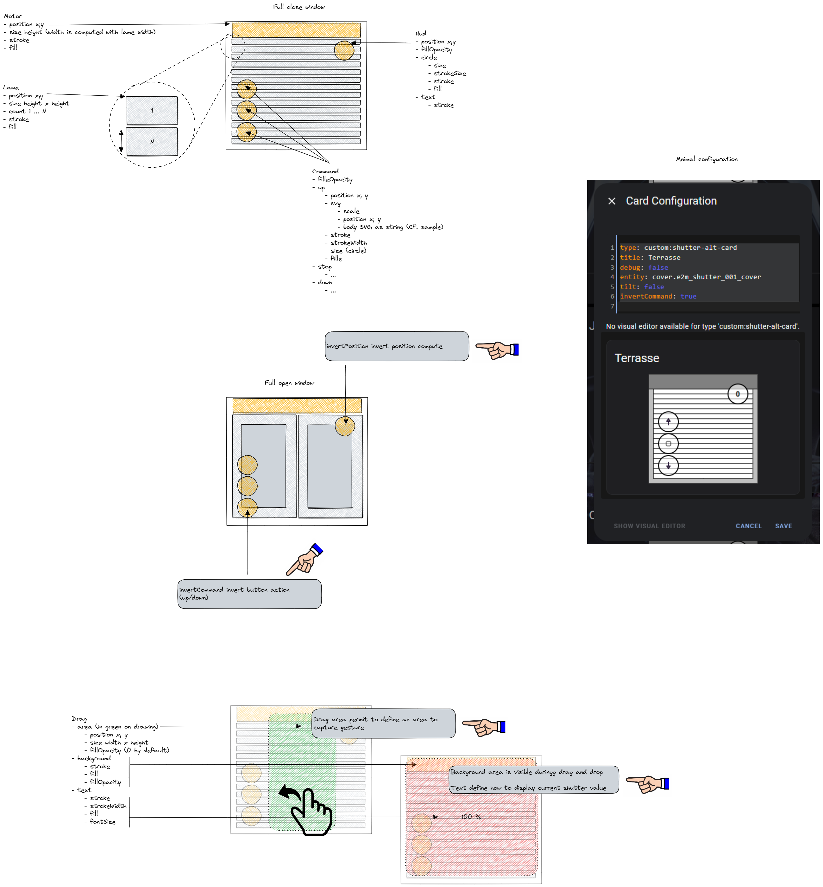

# Component hass-shutter-alt (beta)

Simple homeassistant shutter

This project aim to have a full parametrized shutter (color, position ...)

/!\ this component is in beta mode ... so many bugs can occurs

# Setup

Enable "Advanced Mode" from your user profile page then

- add hass-shutter-alt-card.js to your <config>/www/community folder
- add url /local/community/hass-shutter-alt-card.js?v=1 from Configuration -> Lovelace Dashboards -> Resources panel
  v1 can be usefull to force refresh on js file loading in your browser

# Structure

## Abstract



## Default configuration

```yaml
  entity: "cover.pergola_roof"
  debug: true
  misc: 
    stroke: "#000000"
    fill: "#bfbfbf"
  lame: 
    x: 10
    y: 10
    width: 200
    height: 10
    count: 20
    stroke: "#000000"
    fill: "#ffffff"
  motor: 
    x: 0
    y: 0
    height: 30
    stroke: "#000000"
    fill: "#eebb00"
  hud: 
    x: 180
    y: 40
    fillOpacity: 0.6
    circle: 
      size: 20
      strokeSize: 2
      stroke: "#000000"
      fill: "#ffffff"
    text: 
      stroke: "#000000"
  command: 
    fillOpacity: 0.6
    up: 
      x: 40
      y: 96
      svg: 
        scale: 0.9
        x: -12
        y: 12
        body: "<path d=\"M12 11L12 19\" stroke=\"#200E32\" stroke-width=\"2\" stroke-linecap=\"round\" stroke-linejoin=\"round\"/>\n<path fill-rule=\"evenodd\" clip-rule=\"evenodd\" d=\"M16 11L12 5.00001L8.00001 11L16 11Z\" stroke=\"#200E32\" stroke-width=\"2\" stroke-linecap=\"round\" stroke-linejoin=\"round\"/>\n"
      stroke: "#000000"
      strokeWidth: "2"
      size: 20
      fill: "#ffffff"
    stop: 
      x: 40
      y: 140
      svg: 
        scale: 0.9
        x: -12
        y: 12
        body: "\n<path fill-rule=\"evenodd\" clip-rule=\"evenodd\" d=\"M9 8C8.44772 8 8 8.44772 8 9V15C8 15.5523 8.44772 16 9 16H15C15.5523 16 16 15.5523 16 15V9C16 8.44772 15.5523 8 15 8H9ZM6 9C6 7.34315 7.34315 6 9 6H15C16.6569 6 18 7.34315 18 9V15C18 16.6569 16.6569 18 15 18H9C7.34315 18 6 16.6569 6 15V9Z\" fill=\"#000000\"/>\n"
      stroke: "#000000"
      strokeWidth: "2"
      size: 20
      fill: "#ffffff"
    down: 
      x: 40
      y: 184
      svg: 
        scale: 0.9
        x: -12
        y: 12
        body: "\n<path d=\"M12 13L12 5\" stroke=\"#200E32\" stroke-width=\"2\" stroke-linecap=\"round\" stroke-linejoin=\"round\"/>\n<path fill-rule=\"evenodd\" clip-rule=\"evenodd\" d=\"M8 13L12 19L16 13L8 13Z\" stroke=\"#200E32\" stroke-width=\"2\" stroke-linecap=\"round\" stroke-linejoin=\"round\"/>\n"
      stroke: "#000000"
      strokeWidth: "2"
      size: 20
      fill: "#ffffff"
```
